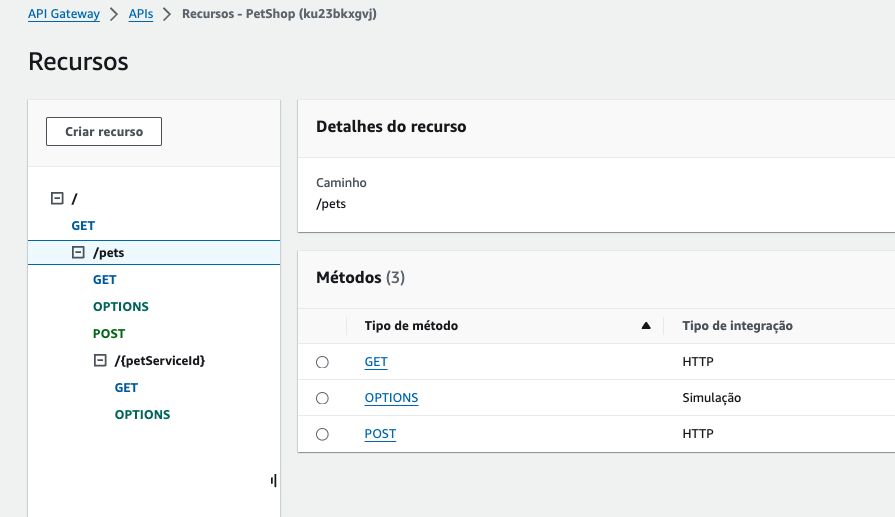
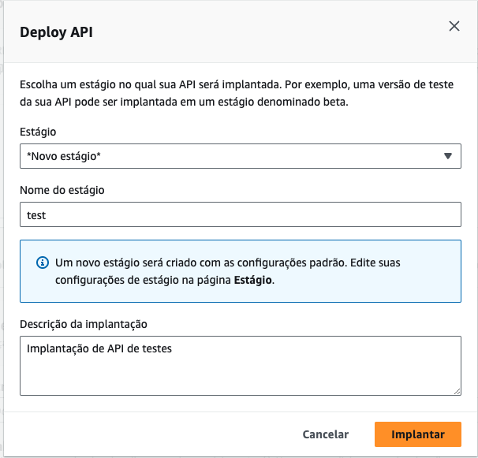
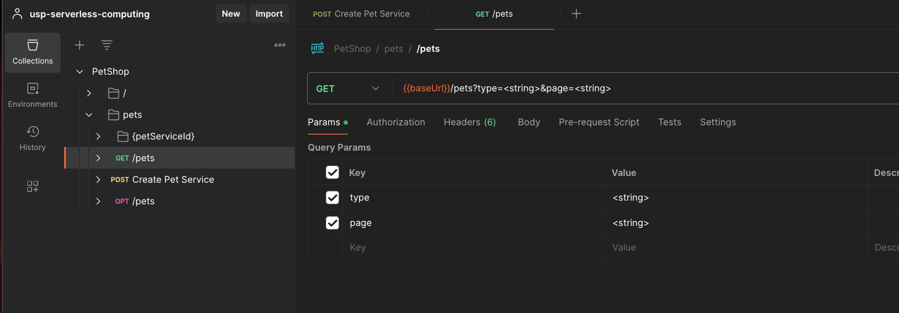
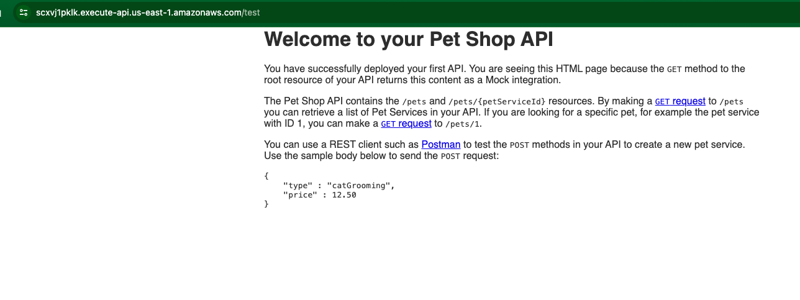

# 01 - Primeira API

OBJETIVO: Criar a primeira api no serviço [Amazon API Gateway](https://aws.amazon.com/pt/api-gateway/) utilizando a estrutura de exemplo do painel.

1. Abra o serviço [API Gateway](https://us-east-1.console.aws.amazon.com/apigateway/main/apis?region=us-east-1)
    
    

2. Desça nas opções da tela até `API REST` e clique em `importar`.
   
   

3. Escolha a opção `API de exemplo` e clique em `Criar API`
   
   

   > [Swagger](https://swagger.io/) é uma especificação e um conjunto de ferramentas de código aberto projetadas para ajudar desenvolvedores a projetar, construir, documentar e consumir APIs RESTful de maneira fácil e eficiente. Atua como um contrato entre o serviço de API e seus consumidores, permitindo uma compreensão clara das funções da API, dos parâmetros esperados e dos formatos de resposta. As principais versões do Swagger incluem a versão 1.x, que introduziu o conceito; a versão 2.0, que trouxe melhorias significativas na especificação, permitindo descrições mais detalhadas das APIs, incluindo informações sobre autenticação, modelos de dados e métodos HTTP suportados; e a OpenAPI Specification (OAS) versão 3.0 e posteriores (3.0.x, 3.1.0), que evoluíram a partir do Swagger, ampliando ainda mais as capacidades de descrição da API com suporte a mais tipos de conteúdo, links entre operações, e outras funcionalidades avançadas. A transição para o termo OpenAPI Specification, adotado pela versão 3.0, reflete a maturidade e a adoção ampla da iniciativa, promovendo ainda mais a interoperabilidade e a padronização das APIs RESTful.


    ># PetStore API Documentation
        Esta documentação descreve a API PetStore, criada como um exemplo de integração via HTTP com endpoints demo Pet Store usando o Amazon API Gateway.

        ## Informações Gerais

        - **Versão Swagger**: 2.0
        - **Descrição**: Your first API with Amazon API Gateway. This is a sample API that integrates via HTTP with our demo Pet Store endpoints.
        - **Título**: PetStore
        - **Esquemas**: HTTPS

        ## Endpoints

        ### Raiz `/`

        #### GET

        - **Tags**: pets
        - **Descrição**: PetStore HTML web page containing API usage information.
        - **Consumes**: application/json
        - **Produces**: text/html
        - **Respostas**:
        - **200**: Successful operation. Retorna uma página HTML com informações de uso da API.

        ### `/pets`

        #### GET

        - **Tags**: pets
        - **Sumário**: List all pets
        - **Produces**: application/json
        - **Parâmetros**:
        - `type` (query): The type of pet to retrieve (opcional).
        - `page` (query): Page number of results to return (opcional).
        - **Respostas**:
        - **200**: Successful operation. Retorna uma lista de pets.

        #### POST

        - **Tags**: pets
        - **Sumário**: Create a pet
        - **Consumes**: application/json
        - **Produces**: application/json
        - **Parâmetros**:
        - **Body** (`NewPet`): Pet object that needs to be added to the store.
        - **Respostas**:
        - **200**: Successful operation. Retorna detalhes do pet criado.

        ### `/pets/{petId}`

        #### GET

        - **Tags**: pets
        - **Sumário**: Info for a specific pet
        - **Produces**: application/json
        - **Parâmetros**:
        - `petId` (path): The id of the pet to retrieve.
        - **Respostas**:
        - **200**: Successful operation. Retorna detalhes do pet especificado.

        ## Modelos

        ### `Pets`

        - **Tipo**: array
        - **Itens**: Referência a `Pet`.

        ### `Pet`

        - **Tipo**: object
        - **Propriedades**:
        - `id`: integer
        - `type`: string
        - `price`: number

        ### `NewPet`

        - **Tipo**: object
        - **Propriedades**:
        - `type`: Referência a `PetType`.
        - `price`: number

        ### `NewPetResponse`

        - **Tipo**: object
        - **Propriedades**:
        - `pet`: Referência a `Pet`.
        - `message`: string

        ### `PetType`

        - **Tipo**: string
        - **Enum**: [dog, cat, fish, bird, gecko]


4. No canto inferior direito da tela clique em `Importar`
5. Sua API ficará com a seguinte estrutura:
   
   

6. Faça testes antes de executar o deploy da API. Para isso vá em `POST` do `/pets/`.
   
   

7. Clique na aba `Teste` no centro da tela.
8.  No campo `Corpo de solicitação` cole o seguinte conteúdo:
   ``` json
   {"type": "dog", "price": 249.99}
   ```

   

9.  Na parte inferior da tela clique em `Teste`. Você executou o teste dessa chamada da sua API. Você pode ver a resposta em `Corpo de resposta` e todos os logs da chamada em `Logs`
    
    

10. Agora sim é hora de implantar a API para ter uma URL a ser chamada. Para isso visite o canto superior direito da tela clique em `Implantar API`
    
    

11. Preencha os campos do formulário como na imagem abaixo:

    

12. Clique em `Implantar`.
13. Pronto você criou sua primeira API no API Gateway e a URL para chamar esta na tela no campo `Invocar URL`.
14. Vamos executar chamadas de teste via [POSTMAN](https://go.postman.co/home) para testar a API externamente. No topo direito clique em `Ações de estágio` e clique em `Exportar`.
    

15. Escolha as opções abaixo e clique em `Exportar API`:
    1. Tipo de especificação de API: `Swagger`
    2. Formanto: `YAML`
    3. Extensões: `Exportar com extensões Postman`

    

16. Abra o [POSTMAN](https://go.postman.co/home) no navegador para carregar o arquivo que foi baixado no passo anterior descrevendo como utilizar a API. Certifiquesse de que esta na workspace `usp-serverless-computing`.
17. Dentro do Postman clique em `Import`.
    
    

18. Carregue o arquivo recém baixado do API Gateway. Após carregar o arquivo o postman ficará como na imagem abaixo, cliquem em `Import`:
    
    

19. Expanda os campos até chegar em `POST Create Pet` e clique para abrir no editor. Copie o json abaixo no corpo da requisição na aba `Body`.
    ``` json
    {
      "type": "bird",
      "price": 234.98
    }
    ```
    
    

20. Clique em `Send` na lateral direita da tela. Você acabou de fazer uma chamada para sua API via postman.
    
    
21. Agora você fará uma chamada de listagem. Para isso clique em `Get /pets` para abrir no editor.

    

22. Edite o valor do campo `type` para `cat` e o valor do campo `page` para `1`.
    
    

23. Clique em `Send` no superior direito para executar a listagem.

    

24. Como ultimo teste, o path principal da sua API retorna um HTML quando chamada via método GET(Caso dos navegadores). Retorne ao API Gateway e copie a URL da sua API e cole no navegador.
    
    

    
