# 02 - HTTP-API

Nesse exercicio você vai criar um infra estrutura com uma [HTTP API do API Gateway](https://docs.aws.amazon.com/pt_br/apigateway/latest/developerguide/http-api-vs-rest.html) conectada a um backend [lambda](https://docs.aws.amazon.com/pt_br/lambda/latest/dg/welcome.html) e um banco de dados [dynamoDB](https://docs.aws.amazon.com/pt_br/amazondynamodb/latest/developerguide/Introduction.html)


1. Primeiro crie o dynamoDB. Para isso acesse o [console](https://us-east-1.console.aws.amazon.com/dynamodbv2/home?region=us-east-1#service) e clique em `Criar tabela` no lado direito da tela.
   
   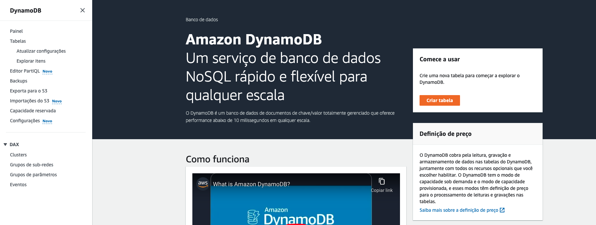

<blockquote>
O <a href="https://aws.amazon.com/pt/pm/dynamodb/">Amazon DynamoDB</a> é um serviço de banco de dados NoSQL oferecido pela Amazon Web Services (AWS). É projetado para fornecer desempenho rápido e previsível com a capacidade de escalar automaticamente de acordo com as necessidades do aplicativo. Como um serviço gerenciado, ele cuida da manutenção do banco de dados, como provisionamento de hardware, replicação de dados para durabilidade e escalonamento automático.

DynamoDB suporta modelos de dados de chave-valor e documentos, o que o torna versátil para diferentes tipos de aplicações. Ele permite criar tabelas que podem armazenar e recuperar qualquer quantidade de dados e lidar com qualquer nível de tráfego de solicitações. Uma característica chave do DynamoDB é sua natureza sem esquema para as colunas (exceto pela chave primária), o que significa que cada registro pode ter um conjunto diferente de colunas.

Os desenvolvedores podem usar o DynamoDB para criar aplicações que exigem alta disponibilidade e desempenho em escala, como jogos móveis, serviços de IoT, aplicativos móveis e web, e muitos outros. Além disso, oferece recursos como backups sob demanda, recuperação de ponto no tempo e exclusão automática de itens expirados, ajudando a gerenciar os dados de forma eficiente e segura.

</blockquote>  

2. Preencha o campos da seguinte maneira:
   1. Nome da tabela: `http-crud-tutorial-items`
   2. Chave de partição: `id`

    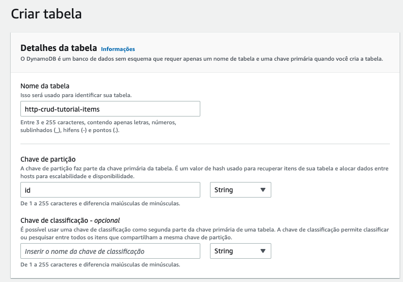

3. Sem mais alterações clique em `Criar tabela` no final da página. 
4. Aguarde até a tabela ficar ativa como na imagem
   
   

5. Agora crie a função lambda que será utilizada na sua arquitetura. Dessa vez você criará a função Lambda de maneira manual. Entre no [console](https://us-east-1.console.aws.amazon.com/lambda/home?region=us-east-1#/functions) do lambda.
   
   

6. Clique em `Criar Função` no superior direito da tela.
7. Preencha os campos da seguinte maneira
   1. Nome da função: `http-crud-tutorial-function`
   2. Tempo de execução: `Node.js 16.x`
   3. Em Permissões, escolhe `Criar uma função a partir da política da AWS templates` e selecione `Permissões de microsserviço simples` e de o nome de `http-crud-tutorial-function-role` para a função.

    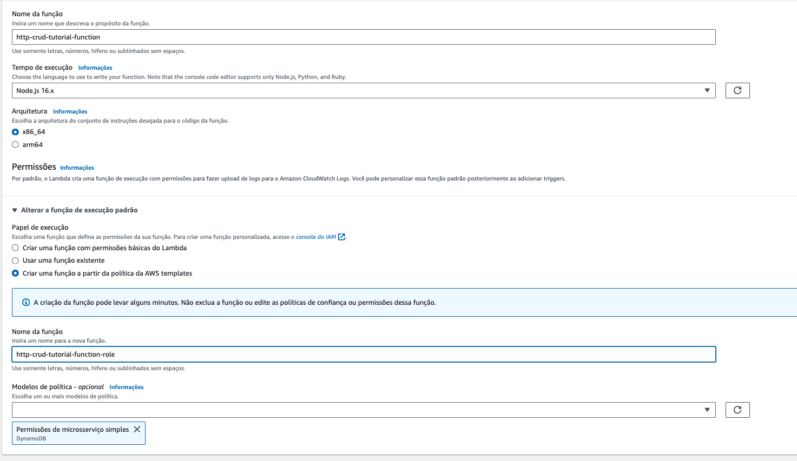

8. Sem mais alterações clique em `Criar função` no final da página.
9.  Note que no meio da tela tem um IDE em `Origem do código`. Na lateral desse IDE abra o arquivo `index.js` com um duplo clique.
10. Copie o código abaixo e cole no IDE do lambda.
```node
const AWS = require("aws-sdk");

const dynamo = new AWS.DynamoDB.DocumentClient();

exports.handler = async (event, context) => {
  let body;
  let statusCode = 200;
  const headers = {
    "Content-Type": "application/json"
  };

  try {
    switch (event.routeKey) {
      case "DELETE /items/{id}":
        await dynamo
          .delete({
            TableName: "http-crud-tutorial-items",
            Key: {
              id: event.pathParameters.id
            }
          })
          .promise();
        body = `Deleted item ${event.pathParameters.id}`;
        break;
      case "GET /items/{id}":
        body = await dynamo
          .get({
            TableName: "http-crud-tutorial-items",
            Key: {
              id: event.pathParameters.id
            }
          })
          .promise();
        break;
      case "GET /items":
        body = await dynamo.scan({ TableName: "http-crud-tutorial-items" }).promise();
        break;
      case "PUT /items":
        let requestJSON = JSON.parse(event.body);
        await dynamo
          .put({
            TableName: "http-crud-tutorial-items",
            Item: {
              id: requestJSON.id,
              price: requestJSON.price,
              name: requestJSON.name
            }
          })
          .promise();
        body = `Put item ${requestJSON.id}`;
        break;
      default:
        throw new Error(`Unsupported route: "${event.routeKey}"`);
    }
  } catch (err) {
    statusCode = 400;
    body = err.message;
  } finally {
    body = JSON.stringify(body);
  }

  return {
    statusCode,
    body,
    headers
  };
};

```


<blockquote>
Este código é um exemplo de função Lambda em Node.js que interage com o Amazon DynamoDB para realizar operações CRUD (Create, Read, Update, Delete) em itens dentro de uma tabela específica. Vamos detalhar cada parte do código:

- `const AWS = require("aws-sdk");`  
  Importa o SDK da AWS para Node.js, permitindo que o código interaja com os serviços da AWS, incluindo o DynamoDB.

- `const dynamo = new AWS.DynamoDB.DocumentClient();`  
  Cria uma instância do cliente DynamoDB Document Client, uma abstração do DynamoDB que facilita trabalhar com documentos JSON.

- `exports.handler = async (event, context) => { ... };`  
  Define a função handler que será invocada pelo AWS Lambda quando o serviço for acionado. `event` contém informações sobre a solicitação, e `context` oferece informações sobre a execução da função.

- `let body; let statusCode = 200;`  
  Inicializa variáveis para armazenar o corpo da resposta e o código de status HTTP. O código de status é inicialmente definido como 200, indicando sucesso.

- `const headers = { "Content-Type": "application/json" };`  
  Define os cabeçalhos da resposta, especificando que o tipo de conteúdo é JSON.

- `switch (event.routeKey) { ... }`  
  Utiliza a chave de rota do evento para determinar qual operação CRUD executar. `event.routeKey` contém a informação sobre o tipo de solicitação HTTP e o caminho.

  - `case "DELETE /items/{id}":`  
    Trata solicitações DELETE para remover um item com um ID específico da tabela.

  - `case "GET /items/{id}":`  
    Trata solicitações GET para recuperar um item específico pelo ID da tabela.

  - `case "GET /items":`  
    Trata solicitações GET para listar todos os itens da tabela usando o método `scan`.

  - `case "PUT /items":`  
    Trata solicitações PUT para criar ou atualizar um item na tabela. O corpo da solicitação é esperado como um JSON contendo `id`, `price` e `name`.

- `await dynamo...promise();`  
  Cada operação do DynamoDB (`delete`, `get`, `scan`, `put`) é chamada com os parâmetros necessários e espera-se que a operação seja concluída usando `await`. `.promise()` converte a operação em uma Promessa, facilitando o uso com async/await.

- `catch (err) { ... }`  
  Captura e trata erros que podem ocorrer durante as operações do DynamoDB, ajustando o código de status e o corpo da resposta.

- `finally { body = JSON.stringify(body); }`  
  Antes de retornar a resposta, o corpo é convertido para uma string JSON.

- `return { statusCode, body, headers };`  
  Retorna a resposta, que inclui o código de status, o corpo da resposta (como uma string JSON) e os cabeçalhos.

Este código demonstra um padrão comum para funções Lambda que servem como back-end para aplicações web ou móveis, lidando com diferentes tipos de solicitações HTTP para operar sobre um banco de dados DynamoDB.

</blockquote>

11.  Clique em `Deploy` ao lado da tecla laranja de Test. Isso irá publicar a função lambda na AWS.
12. Hora de criar a API HTTP. Entre no [console](https://us-east-1.console.aws.amazon.com/apigateway/main/apis?region=us-east-1) do API Gateway para isso.
13. Clique em `Criar API`
14. Em `API HTTP` clique em `Compilar`
    
    

15. No nome da api coloque `http-crud-tutorial-api` e clique em Avançar.
    
    

16. As rotas serão criadas posteriormente então na pagina de configuração de rotas apenas clique em `Avançar`
    
    

17. Em `Configurar estágios` clique em `Avançar`
18. Revise e clique em `Criar`
    
    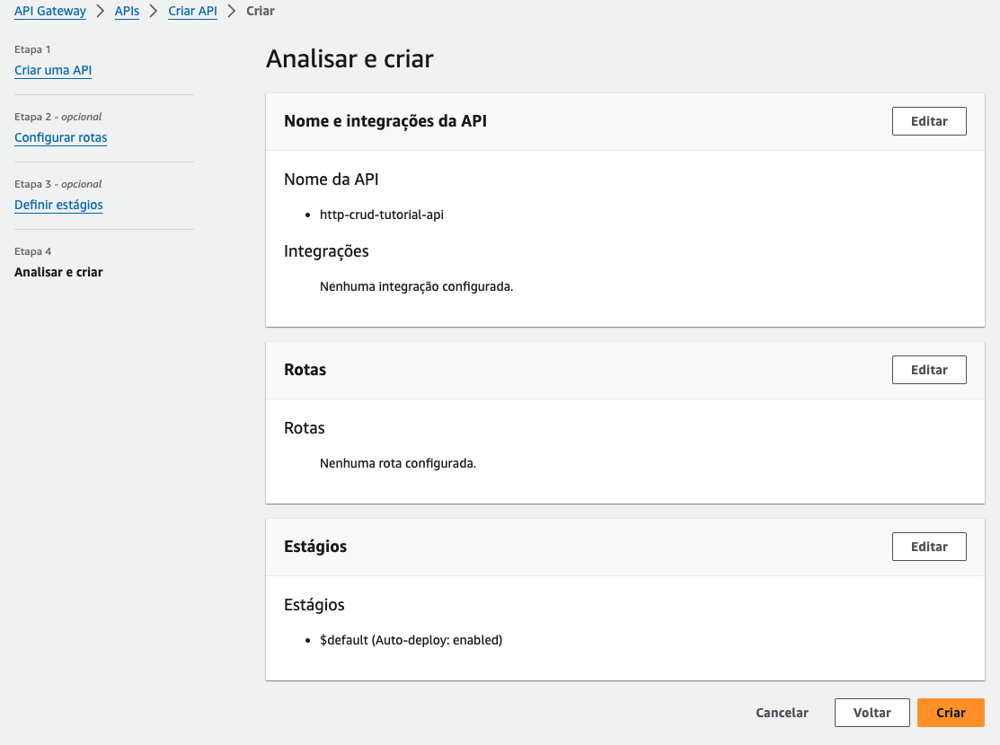
    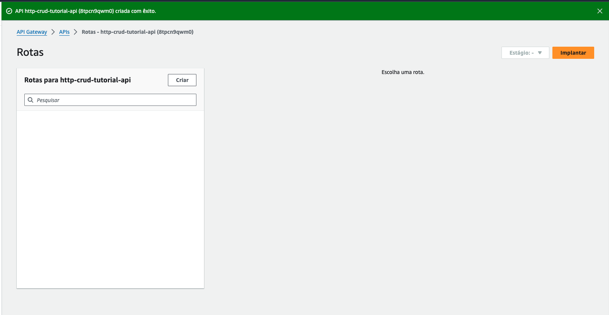

19. Agora você irá criar as 4 rotas dessa API. Para isso na API recém criada clique em `Rotas` na lateral esquerda.

    

20. Clique em `Create`
21. No método selecione `GET` e na rota digite `/items/{id}` e clique em `Criar`.

    

22. Repita os ultimos passos mais 3 vezes com os seguintes valores:
    1. Método: `GET` path: `/items`
    2. Método: `DELETE` path: `/items/{id}`
    3. Método: `PUT` path: `/items`


    

23. Com as rotas prontas é necessário fazer a integração com o lambda que criou anteriormente. Para isso clique em `Integrações` na lateral esquerda da página e então selecione a aba `Gerenciar integrações`.


24. Clique em `Create`
25. Selecione os seguintes valores no formulário e clique em criar no final da página:
    1. Anexar essa integração a uma rota: `GET /items/{id}`
    2. Destino da integração: `Função do Lambda`
    3. Função do Lambda: `http-crud-tutorial-function`


26. Repita o passo anterior mais 3 vezes alterando a rota alvo por:
    1. PUT /items
    2. GET /items
    3. DELETE /items/{id}

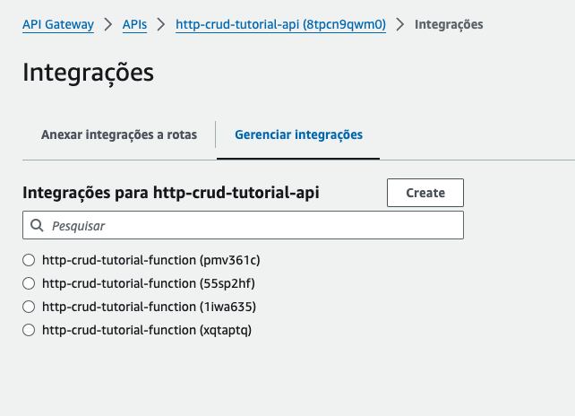

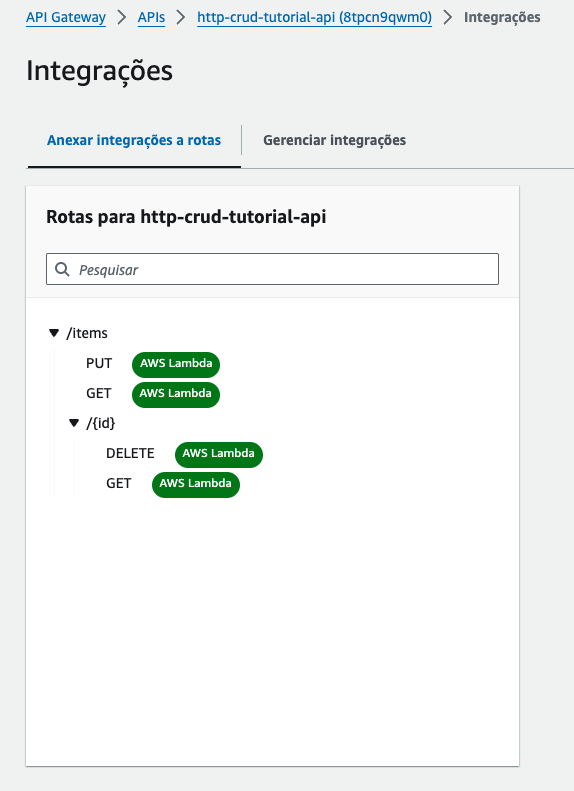

27. Vamos executar os testes da API. Abra o [POSTMAN](https://go.postman.co/home) no navegador e clique em `import`. Dentro do selecione a aba `Link`.
    
    

28. No link copie o conteudo abaixo e clique em `continue`:
```url
https://raw.githubusercontent.com/vamperst/fiap-gerenciamento-de-apis/master/02-HTTP-API/http-crud-tutorial-api.postman_collection.json
```
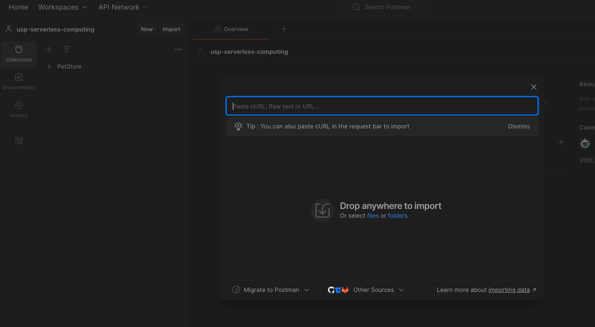

29. Verifique as informações e clique em `Import`
    
    

30. Você irá precisar da URL base da sua API. Para isso abra seu painel do [API Gateway](https://us-east-1.console.aws.amazon.com/apigateway/main/apis?region=us-east-1), clique na api `http-crud-tutorial-api` e copie a URL descrita em `Invocar URL`
    
    

    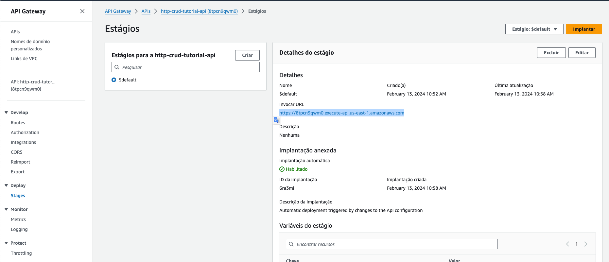

31. De volta ao POSTMAN, clique em `Collections`.
    
    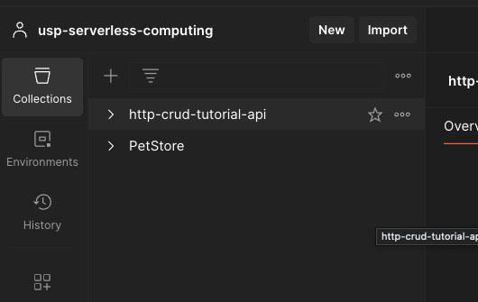

32. Clique em `http-crud-tutorial-api` e selecione a aba `Variables`
    
    

33. Na variavel BaseUrl cole a URL copiada da sua API onde esta escrito `SUA URL` e clique em `Save` no canto superior direito da tela.
    
    

34. A primeira chamada que devemos fazer é para inserir objetos no banco. Para tal abra a chamada `PUT Items` do postman e clique na aba `Body`.
    
35. Clique em `Send` e se tudo ocorrer bem você verá a mensagem `Put item 124` na parte inferior da página.
36. Altere o valor do id no json 3 vezes com os valores abaixo e clique em `Send` para adicionar mais 3 itens na tabela.
    1. Id: `123`
    2. Id: `125`
    3. Id: `126`

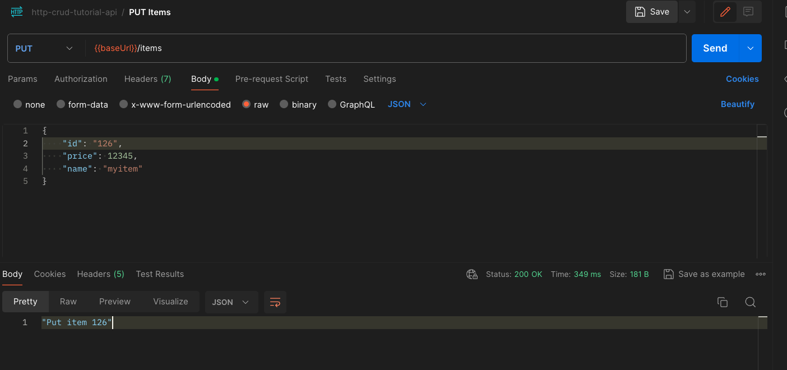

37. Com 4 itens na tabela agora você irá listar esses itens. Clique em `GET Items` e então clique em `Send`. Esse método deve listar todos os objetos inseridos.
    
    

38. Para deletar um item clique em `DELETE Items/{id}`. Como pode ver na URL o item 124 esta descrito. Clique em `Send` para apagar esse item. 
    
    

39. Para ver que agora tem apenas 3 items no banco de dados você pode executar a listagem GET novamente.
40. Para visualizar os itens diretamente na tabela do DynamoDB clique no [link](https://us-east-1.console.aws.amazon.com/dynamodbv2/home?region=us-east-1#item-explorer?initialTagKey=&table=http-crud-tutorial-items)


