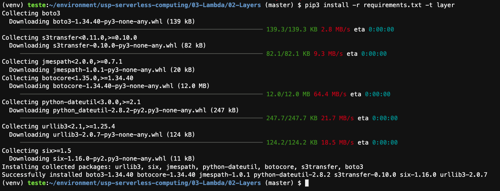
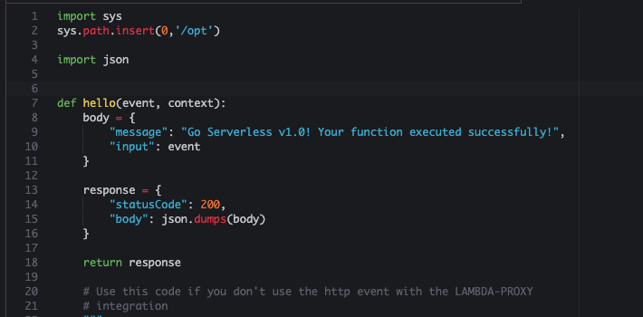
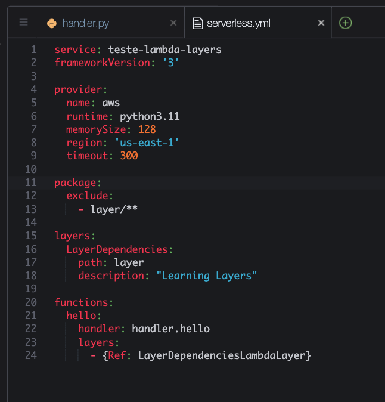
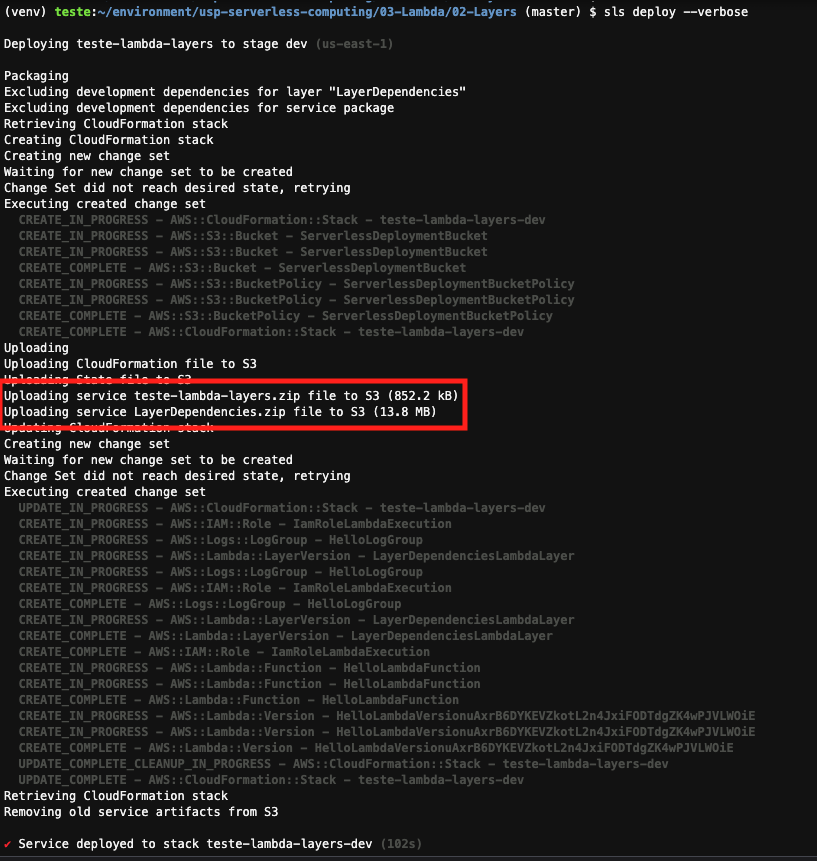

# Aula 03.2 - Lambda Layers

1. No terminal do IDE criado no cloud9 execute o comando `cd ~/environment/usp-serverless-computing/03-Lambda/02-Layers/` para entrar na pasta que fara este exercicio.
   
2. Iniciar o repositório de trabalho `sls create --template "aws-python3"`.

    

3. Crie um arquivo chamado requirements.txt com o conteúdo 'boto3' Crie o arquivo com o comando `c9 open requirements.txt`. Salve com CTRL+S.
       
      

<blockquote>
O arquivo `requirements.txt` é um arquivo de texto usado em projetos Python para listar as bibliotecas das quais o projeto depende. Quando o arquivo `requirements.txt` contém apenas a linha `boto3`, isso significa que o projeto tem uma única dependência: a biblioteca `boto3`.
</blockquote>
<blockquote>
A biblioteca `boto3` é o kit de software da Amazon Web Services (AWS) para Python, permitindo que os desenvolvedores Python escrevam software que usa serviços como Amazon S3, Amazon EC2, Amazon DynamoDB, e mais. A presença de `boto3` no `requirements.txt` indica que o projeto provavelmente interage com uma ou mais dessas tecnologias AWS.
</blockquote>

4. Execute o comando no terminal `pip3 install virtualenv && python3 -m venv ~/venv` para criar um ambiente virtual python e pode baixar as dependencias sem conflitar com nenhuma dependecia já baixada.
5. Execute o comando no terminal `source ~/venv/bin/activate` para ativar o ambiente virtual criado no passo anterior
6. Crie uma pasta chamada `layer` utilizando o comando no terminal `mkdir layer`.
7. Execute o comando `pip3 install -r requirements.txt -t layer` para instalar todas as dependencias listadas no arquivo requirements.txt dentro da pasta layer.
    
    

8. Execute o comando `c9 open handler.py` e altere o topo do arquivo handler.py para que fique como na imagem:
   
   

<blockquote>
    O comando Python `import sys` seguido de `sys.path.insert(0, '/opt')` é frequentemente usado em projetos que envolvem funções AWS Lambda, especialmente quando se trabalha com Lambda Layers. Vamos detalhar cada parte desse comando e entender sua importância no contexto de Lambda Layers:

   - `import sys`: Este comando importa o módulo `sys` para o script Python. O módulo `sys` é um dos módulos padrão do Python que fornece acesso a algumas variáveis e funções que interagem fortemente com o interpretador Python. Uma dessas variáveis é `sys.path`.

   - `sys.path`: É uma lista de strings que especifica os caminhos do sistema de arquivos onde o interpretador Python procura por módulos para importar. Por padrão, essa lista inclui o diretório onde o script que está sendo executado está localizado, além de outros diretórios padrão onde os módulos Python são normalmente instalados.

   - `sys.path.insert(0, '/opt')`: Este comando insere o caminho `/opt` no início da lista `sys.path`. O método `insert` é utilizado para adicionar o caminho na primeira posição da lista (índice `0`), o que significa que `/opt` será o primeiro diretório a ser procurado pelo Python quando tentar importar um módulo.

   No contexto das AWS Lambda Layers:

   - **Lambda Layers**: São componentes reutilizáveis que contêm bibliotecas, dependências personalizadas ou até mesmo código personalizado que pode ser compartilhado entre várias funções Lambda. Quando você associa uma camada a uma função Lambda, o conteúdo da camada é extraído para o diretório `/opt` no ambiente de execução da Lambda.

   - **Por que usar `sys.path.insert(0, '/opt')` com Lambda Layers?**: Ao utilizar Lambda Layers para incluir bibliotecas ou módulos personalizados, esses elementos são armazenados no diretório `/opt`. Para que sua função Lambda possa importar e utilizar essas bibliotecas ou módulos, é necessário adicionar `/opt` ao `sys.path`, garantindo que o Python procure nesse diretório por módulos a serem importados. Fazer isso no início do seu script Lambda (`sys.path.insert(0, '/opt')`) assegura que os módulos contidos nas camadas sejam acessíveis e tenham prioridade sobre módulos de mesmo nome localizados em outros diretórios da lista `sys.path`.

   Utilizar esse comando é uma prática comum para garantir que as funções Lambda possam facilmente utilizar o código e as bibliotecas armazenadas nas Lambda Layers, promovendo a reutilização de código e simplificando a gestão de dependências em projetos serverless.

</blockquote>

9.  Execute o comando `c9 open serverless.yml`, No serverless.yml deixe o arquivo como na imagem, podem apagar todo o conteudo existente:
     
   

<blockquote>

**Package Configuration:**

- `package:`  
  Configurações de empacotamento da aplicação.
  
  - `exclude:`  
    Lista de padrões de arquivos ou diretórios a serem excluídos do pacote de implantação.

    - `- layer/**`  
      Exclui o diretório `layer` e seu conteúdo do pacote de implantação. Este diretório é utilizado para definir as dependências das Lambda Layers, mas não deve ser incluído no pacote da função Lambda.

**Layers Configuration:**

- `layers:`  
  Define uma ou mais Lambda Layers para o serviço.
  
  - `LayerDependencies:`  
    Nome da Lambda Layer dentro da configuração.

    - `path: layer`  
      Especifica o caminho do diretório contendo os arquivos da Layer. O Serverless Framework empacota tudo neste diretório como uma Layer.

    - `description: "Learning Layers"`  
      Uma descrição para a Layer, facilitando a identificação de seu propósito.

**Functions Configuration:**

- `functions:`  
  Define as funções Lambda do serviço.
  
  - `hello:`  
    Configuração para uma função Lambda chamada `hello`.

    - `handler: handler.hello`  
      Especifica o manipulador da função, indicando que a função `hello` definida no arquivo `handler.py` será invocada quando a função Lambda for acionada.

    - `layers:`  
      Lista de Lambda Layers a serem associadas à função.

      - `- {Ref: LayerDependenciesLambdaLayer}`  
        Utiliza uma referência CloudFormation para associar a Layer `LayerDependencies` à função `hello`. Isso permite que a função utilize as bibliotecas ou dependências definidas na Layer.

Este arquivo `serverless.yml` define um serviço serverless com uma função Lambda e uma Lambda Layer. A função `hello` é configurada para utilizar a Layer `LayerDependencies`, que contém dependências externas ou bibliotecas compartilhadas, promovendo a reutilização de código e a organização eficiente das dependências do projeto.

</blockquote>

1.   Fazer deploy da função criada `sls deploy --verbose` no terminal do cloud 9.
   
    
<blockquote>
Quando se utiliza o comando `sls deploy` com o Serverless Framework para implantar uma aplicação serverless que inclui Lambda Layers, o processo envolve vários passos-chave, especialmente no que diz respeito ao empacotamento de dependências em arquivos ZIP separados e à subida desses arquivos para o Amazon S3. Aqui está uma visão geral detalhada desse processo:

1. **Preparação e Empacotamento:**  
   O Serverless Framework começa preparando e empacotando os recursos definidos no arquivo `serverless.yml`. Para Lambda Layers, isso envolve identificar os diretórios especificados para cada Layer na configuração e empacotar o conteúdo de cada um desses diretórios em arquivos ZIP separados. Cada Layer é tratado como uma entidade independente, o que permite a reutilização dessas Layers em diferentes funções Lambda dentro do mesmo projeto ou em projetos distintos.

2. **Upload para o S3:**  
   Uma vez que os arquivos ZIP das Layers foram criados, o Serverless Framework faz o upload desses arquivos para um bucket do AWS S3. O bucket utilizado pode ser especificado pelo usuário ou, na ausência dessa especificação, o Framework pode criar ou utilizar um bucket padrão associado ao projeto. Cada arquivo ZIP de Layer é carregado com um identificador único, garantindo que versões diferentes das Layers sejam mantidas separadamente no S3.

3. **Criação de Lambda Layers na AWS:**  
   Com os arquivos ZIP já carregados no S3, o Serverless Framework procede à criação das Lambda Layers na AWS. Isso é feito através da AWS CLI ou SDK, fornecendo a localização (URL) do arquivo ZIP no S3 como parte dos parâmetros. A AWS então cria a Layer, tornando-a disponível para ser associada a funções Lambda. Durante esse processo, também são definidas as permissões de acesso à Layer, determinando quais contas AWS ou funções podem utilizá-la.

4. **Associação de Layers a Funções Lambda:**  
   Para as funções Lambda definidas no mesmo `serverless.yml` que necessitam das Layers, o Serverless Framework configura a associação dessas Layers às funções correspondentes. Isso é feito referenciando as Layers recém-criadas pela sua ARN (Amazon Resource Name), que é a identidade única da Layer na AWS. Assim, quando a função Lambda é invocada, ela tem acesso às bibliotecas e dependências contidas na Layer.

5. **Implantação de Funções Lambda:**  
   Após a criação e associação das Layers, o processo continua com o empacotamento e implantação das funções Lambda em si. Assim como as Layers, as funções são empacotadas em arquivos ZIP e carregadas para o S3, de onde são implantadas na AWS.

Esse processo automatiza a gestão de dependências e o reuso de código entre funções Lambda, simplificando o desenvolvimento e a implantação de aplicações serverless complexas. Além disso, ao separar as dependências em Layers, reduz-se o tamanho dos pacotes de implantação das funções Lambda, o que pode melhorar os tempos de inicialização a frio e facilitar a manutenção do código.

</blockquote>

11. Em uma outra aba do seu navegavor abra o [console da AWS no serviço Lambda](https://us-east-1.console.aws.amazon.com/lambda/home?region=us-east-1#/functions).
12. Note a função que acabou de criar já esta no painel, para ver a layer clique em "camadas" no menu lateral da página
    
13. Para visualizar as camadas(Layers) criadas abra essa outra [janela](https://us-east-1.console.aws.amazon.com/lambda/home?region=us-east-1#/layers).
    
14. Para invocar remotamente a função utilize o comando `sls invoke -f hello` no terminal do cloud 9
  
15. Destrua a função feita `sls remove`