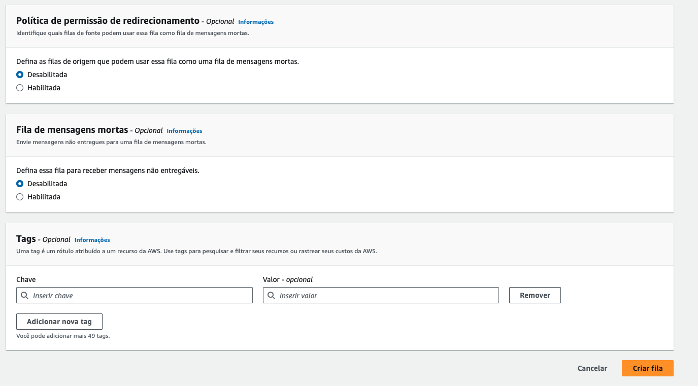
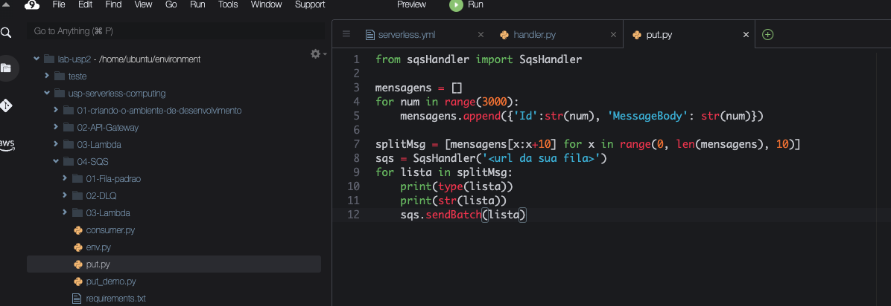
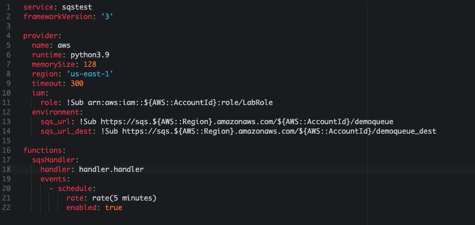
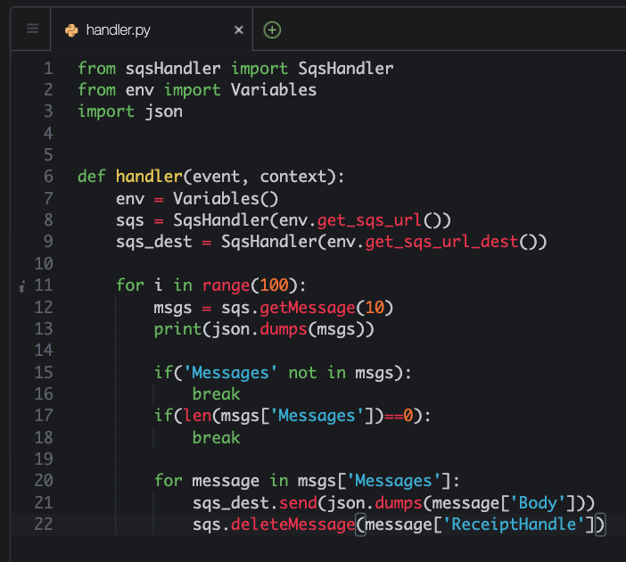
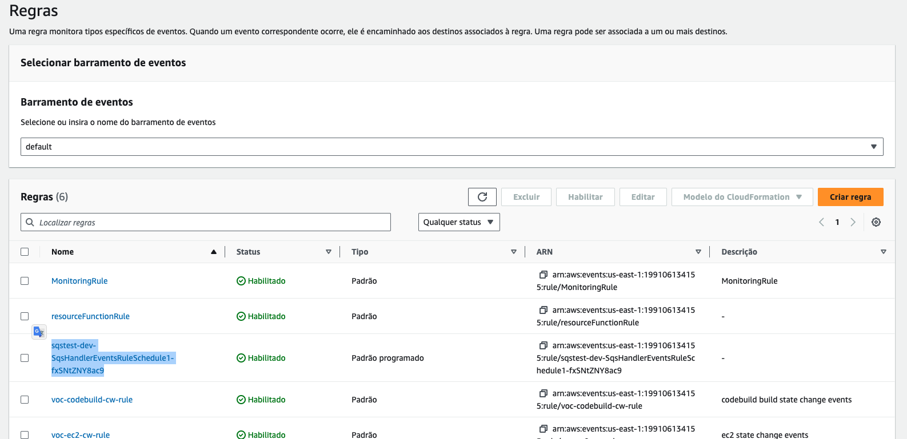

# Aula 04.1 - Standart Queue


<blockquote>
O Amazon Simple Queue Service (SQS) é um serviço de mensageria totalmente gerenciado que permite a integração de componentes de software de maneira fácil e segura, em qualquer volume, sem perder mensagens e sem a necessidade de outros serviços para manter a infraestrutura ativa. O SQS oferece dois tipos de filas: Standard e FIFO (First-In-First-Out).

- **Fila padrão**: As filas Standard oferecem throughput máximo, melhor desempenho e entrega de mensagens na ordem em que são enviadas (best-effort ordering). No entanto, ocasionalmente, uma mensagem pode ser entregue mais de uma vez e a ordem de entrega não é garantida. Essas filas são projetadas para serem altamente disponíveis e escaláveis, proporcionando um caminho robusto para a comunicação entre componentes de aplicativos de forma desacoplada.

- **Características principais**:
  - **Throughput ilimitado**: Não há limitação no número de transações por segundo.
  - **Entrega de mensagem no mínimo uma vez**: As mensagens são entregues pelo menos uma vez, mas podem ser entregues mais de uma vez.
  - **Ordenação de mensagens**: A fila tenta manter a ordem das mensagens, mas não é garantido que as mensagens serão recebidas na exata ordem em que foram enviadas.
  - **Escalabilidade e disponibilidade**: O SQS escala automaticamente para lidar com qualquer volume de mensagens, garantindo alta disponibilidade.

As filas Standard do SQS são ideais para situações em que o volume de mensagens é alto e um nível de tolerância a duplicatas e ordenação flexível é aceitável. Isso as torna adequadas para uma ampla gama de aplicações, desde processos de background em sistemas de TI até sistemas de comunicação em tempo real que necessitam de alta performance e escalabilidade.
</blockquote>

### Criando a fila sqs

1. [Crie uma fila](https://us-east-1.console.aws.amazon.com/sqs/v3/home?region=us-east-1#/create-queue) no sqs colocando o nome 'demoqueue', deixe os valores default e clique em 'Criar Fila'
    

    

2. Copie a URL da sua fila que esta disposta conforme imagem:
    

### Enviando dados para a fila

1. No terminal do CLoud 9 IDE criado no cloud9 execute o comando `cd ~/environment/usp-serverless-computing/04-SQS/01-Fila-padrao/` para entrar na pasta que fara este exercicio.
2. Atualize o repositorio com o comando `git pull origin master`
3. Abra o arquivo put.py com o comando `c9 open put.py`
4. Altere o arquivo put.py adicionando a URL da fila do sqs que criou nos passos anteriores

    

5. Execute os comandos abaixo para garantir que esta em um ambiente virtual do python com as dependencias necessárias para executar o execício:

   ``` shell
   pip3 install virtualenv && python3 -m venv ~/venv
   source ~/venv/bin/activate
   pip3 install boto3
   npm install -g serverless
   ```

6. Execute o comando `python3 put.py` no terminal para colocar 3000 mensagens na fila. Verifique no [console](https://us-east-1.console.aws.amazon.com/sqs/v3/home?region=us-east-1#/queues) o resultado do comando.


### Consumindo SQS

1. [Crie mais uma fila](https://us-east-1.console.aws.amazon.com/sqs/v3/home?region=us-east-1#/create-queue) sqs utilizando o mesmo procedimento do exercicio anterior com o mesmo nome da anterior com o sulfixo '_dest', ficará `demoqueue_dest`
2. Execute o comando no terminal do cloud 9 `sls create --template "aws-python3"`
3. Abra o arquivo serverless.yml com o comando `c9 open serverless.yml`
4. Altere o arquivo 'serverless.yml' e coloque o seguinte conteudo, não esqueça de preencher as duas URLs das filas como descrito:



5. Crie o arquivo 'handler.py' com o seguinte conteudo. O abra com o seguinte comando `c9 open handler.py`

7. rode o comando `sls deploy`
8. Coloque alguns itens na fila com o comando `python3 put.py`, lembrando que cada execução do lambda criado pode consumir até 1000 posições da fila sqs.
9. Para execução do lambda rode o comando `sls invoke -l -f sqsHandler` no terminal
10. Enquando espera o comando terminar pode observar no painel do SQS as mensagens se movendo a cada atualização manual pelo canto direito superior. Lembre que cada execução move 1000 por definição no código. [Link para painel SQS](https://console.aws.amazon.com/sqs/v2/home?region=us-east-1#/queues)
    
11. Vá até o painel de [regras do cloudwath](https://us-east-1.console.aws.amazon.com/events/home?region=us-east-1#/rules?redirect_from_cwe=true) que verá a regra de execução baseada em tempo criada com o serverless framework. A regra tem nome iniciado em `sqstest`

12. Se esperar alguns execuções vai ver que a fila principal vai zerar.
13. Execute o comando `sls remove` no terminal para remover o que foi criado.
